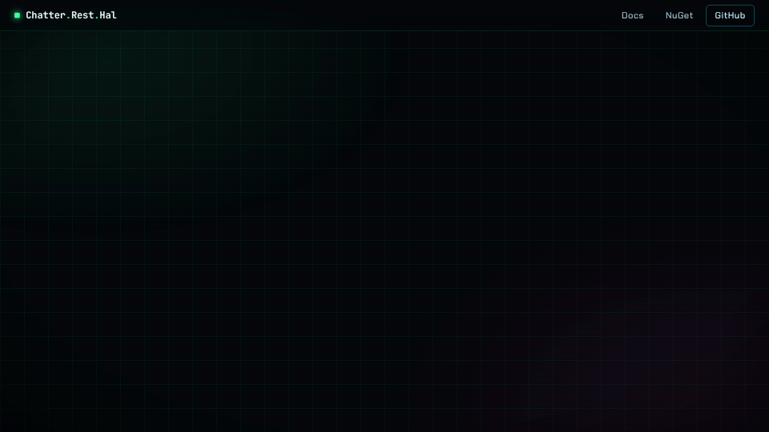
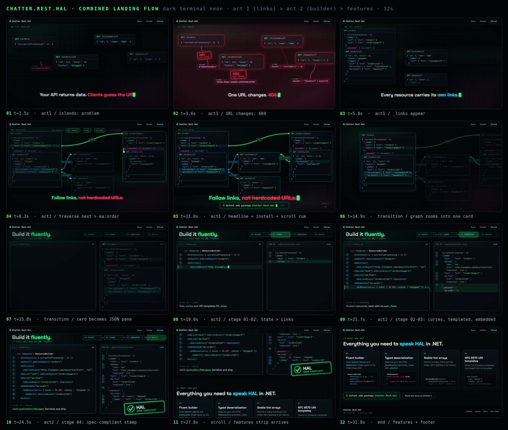
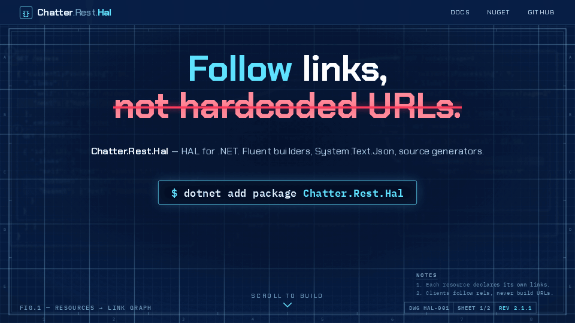
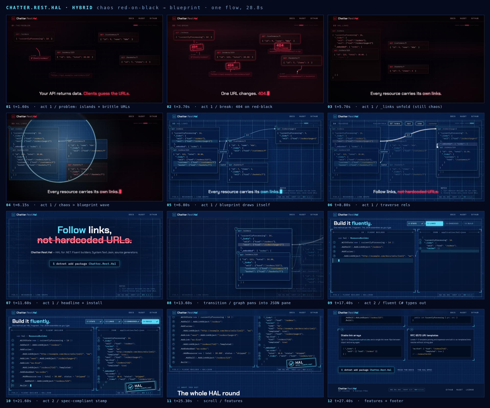

# Chatter.Rest.Hal — landing page motion prototypes

Throwaway branch. Prototypes for the GitHub Pages hero. Not for merge.

## Round 2 — combined page (Islands hero → Live Builder)

Flow: hero (problem → 404 → links graph → traverse → "Follow links, not hardcoded URLs.") → scroll zooms into the `/orders` card, which becomes the JSON pane → "Build it fluently." live builder → features strip → footer.

### A · Neon

Whole page in dark terminal neon.

[Full page](4-combined-neon/fullpage.png) · [Mobile](4-combined-neon/mobile.png)

### B · Hybrid (chaos → blueprint)

Problem act in red-on-black; when `_links` connect, a ring wave turns the world into navy blueprint, and the builder lives in the blueprint.

[Full page](5-combined-hybrid/fullpage.png) · [Mobile](5-combined-hybrid/mobile.png)

## Round 1 — individual concepts

### 1 · Islands → Graph (dark neon)

The problem story: hardcoded URLs break, `_links` connect resources into a navigable graph.

### 2 · Live Builder (blueprint)

The fluent C# builder assembles spec-compliant HAL JSON live.

### 3 · Shape Shift (Swiss editorial)

A single-object vs array link flip breaks clients; `AlwaysUseArrayForLinks` locks the shape.

---

Full-res keyframes are in each `keyframes/` folder. `index.html` in each folder is the live source.
