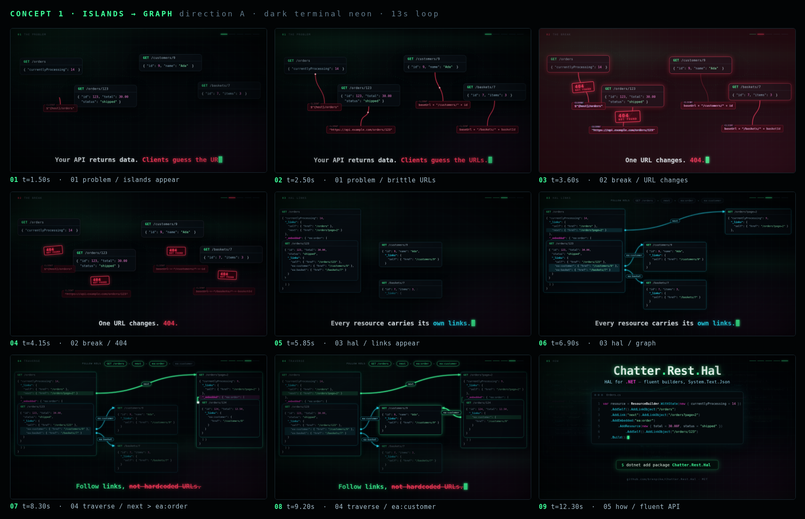
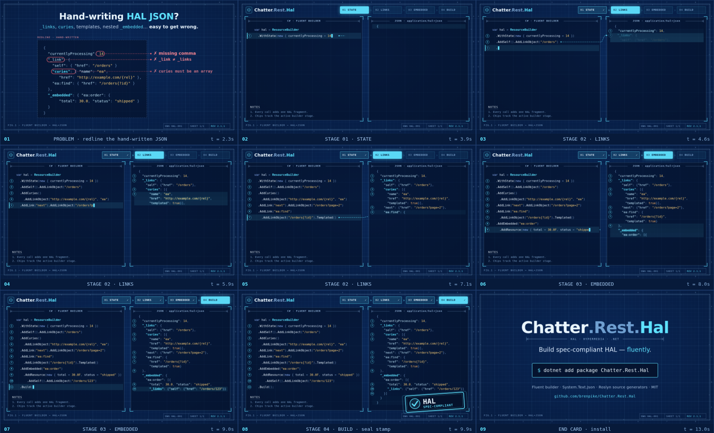
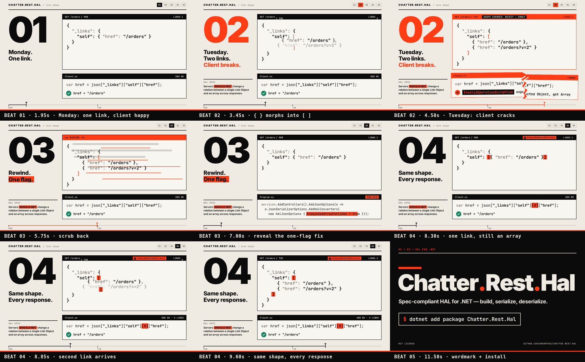

# Chatter.Rest.Hal — landing page motion prototypes

Throwaway branch. Prototypes for the GitHub Pages hero. Not for merge.

## 1 · Islands → Graph (dark neon)

The problem story: hardcoded URLs break, `_links` connect resources into a navigable graph.

## 2 · Live Builder (blueprint)

The fluent C# builder assembles spec-compliant HAL JSON live.

## 3 · Shape Shift (Swiss editorial)

A single-object vs array link flip breaks clients; `AlwaysUseArrayForLinks` locks the shape.

---

Full-res keyframes are in each `keyframes/` folder. `index.html` in each folder is the live source.
